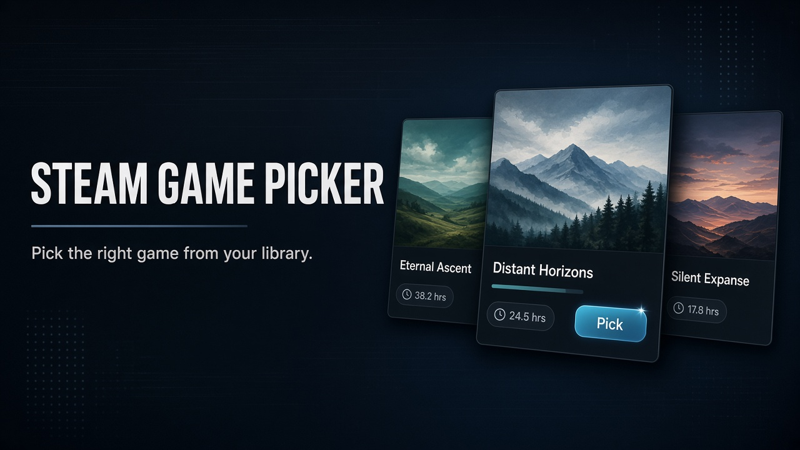

<div align="center">



<br />

**Pick the right game from your Steam library — right now.**

Not your most-played title. Not random. A smart suggestion based on mood, time, and what you haven't played lately.

<br />

[](https://nextjs.org)
[](https://www.typescriptlang.org)
[](https://tailwindcss.com)
[](https://steamcommunity.com/dev)

<br />

[Features](#-features) · [Quick start](#-quick-start) · [Steam setup](#-connect-your-steam-library) · [How it picks](#-how-picking-works) · [Deploy](#-deploy)

</div>

---

## ✨ Features

<table>
<tr>
<td width="50%" valign="top">

### 🎯 Smart picking
Balances **never-played backlog**, **neglected favorites**, **recently enjoyed** games, and **comfort picks** — not just hours played.

### 🎭 Moods & time
Quick session · Deep dive · Something new · Comfort pick · Revisit

### 🔀 Pick & Shuffle
Weighted random selection with a **clear reason** why this game. Shuffle avoids recent repeats.

</td>
<td width="50%" valign="top">

### 🎚️ Filters
Playtime buckets · Never played · Not played in X days · Genres from public store data

### 📚 Full library
Name, playtime, last played, header art, link to Steam store

### 🔒 Privacy-first
Steam ID & API key in **your browser only**. No database. No accounts.

</td>
</tr>
</table>

> **Demo mode included** — try the full app instantly with a sample library. No Steam credentials required.

---

## 🚀 Quick start

**Requirements:** [Node.js](https://nodejs.org) 20.9+

```bash
git clone https://github.com/IvanITD/steam-game-picker.git
cd steam-game-picker
npm install
npm run dev
```

Open [http://localhost:4317](http://localhost:4317). Demo mode is on by default — click **Pick a game** to try it.

Production build on your machine:

```bash
npm run build
npm start
```

---

## 🔑 Connect your Steam library

1. Get a free [Steam Web API key](https://steamcommunity.com/dev/apikey).
2. Find your **Steam ID64** (17 digits) on [steamid.io](https://steamid.io), or paste your custom URL in Settings and click **Resolve**.
3. In Steam: **Settings → Privacy** — set **Profile** and **Game details** to **Public**.
4. In the app: **Settings** → turn off **Use demo library** → enter ID + key → **Save**.

Credentials stay in `localStorage` on this browser. The Next.js server only proxies official Steam Web API calls (`GetOwnedGames`, `ResolveVanityURL`, public store details). Nothing is written to a database.

If the library comes back empty, the usual cause is a private profile or game details.

---

## 🎲 How picking works

Each matching game gets a score: **mood weight × time weight × a little jitter**, then one title is drawn at random by those weights.

| Mood | What it favors |
|------|----------------|
| **Balanced** | Mix of backlog, neglected favorites, and recent play |
| **Quick session** | Shorter / lighter games, low playtime |
| **Deep dive** | Long RPGs and high-hour titles |
| **Something new** | Never-played games |
| **Comfort pick** | Recently enjoyed favorites |
| **Revisit** | Games you loved and then abandoned |

**Time available** (~15 min through 2+ hours) boosts casual/arcade-style tags for short sessions and open-world / RPG tags for long ones.

Every pick includes a reason, e.g. *“You put 57 hours into this but haven't played since last month.”*

**Shuffle** excludes the last five picks so you don't get the same game twice in a row.

---

## ☁️ Deploy

Works on [Vercel](https://vercel.com) with no environment variables.

1. Push the repo (private is recommended if this is just for you).
2. **Add New Project** → import the repo → Deploy.
3. Optional: **Deployment Protection** so only you can open it.

Then connect Steam in Settings on the live URL, same as locally.

Chrome / Edge can **Install** the site as a PWA. On iPhone: Safari → Share → **Add to Home Screen**.

More detail (private GitHub, troubleshooting): [docs/personal-setup.md](docs/personal-setup.md).

---

## 🛠️ Stack

- [Next.js](https://nextjs.org) 16 (App Router) · [React](https://react.dev) 19
- [TypeScript](https://www.typescriptlang.org) 5 · [Tailwind CSS](https://tailwindcss.com) 4
- Official [Steam Web API](https://steamcommunity.com/dev) + public store `appdetails`

---

## 📄 License

[MIT](LICENSE) © 2026 Ivan Ivanov
